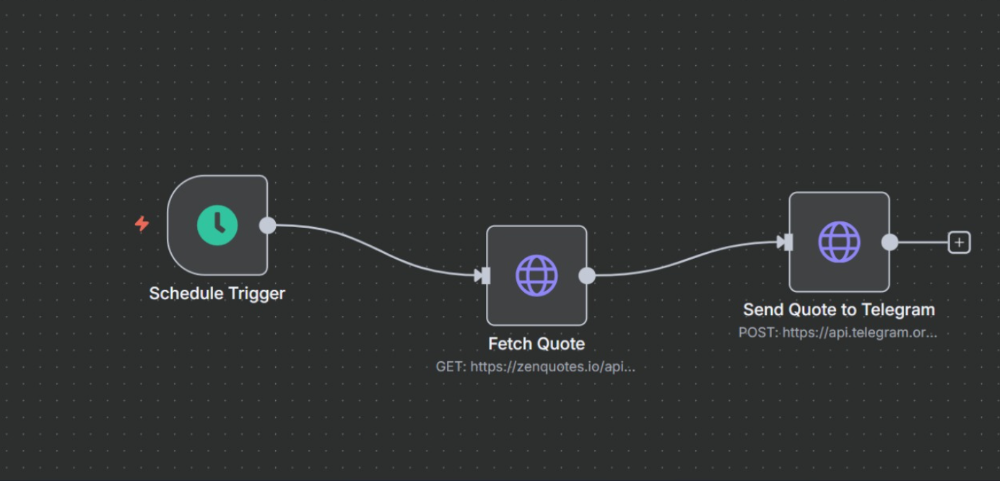

# Telegram Motivation Bot (n8n)

An **automation built with n8n** that delivers a daily dose of positivity ✨  
Every morning at **7:00 AM IST**, this bot fetches a motivational quote from the [ZenQuotes API](https://zenquotes.io/) and shares it with a Telegram chat/channel.

---

## 🌟 Features
- 🕖 **Daily schedule** → Runs automatically every day at 7 AM IST  
- 💬 **Telegram integration** → Sends quotes directly to a chat or channel  
- 📜 **Fresh quotes** → Pulled from ZenQuotes API  
- ⚡ **Low-code automation** → Fully built using [n8n](https://n8n.io/)  

---

## 🛠️ Tech Stack
- **n8n** – workflow automation platform  
- **Telegram Bot API** – sending quotes to your channel  
- **ZenQuotes API** – source of motivational quotes  

---

## 📂 Repository Contents
- `workflow.json` → Exported n8n workflow  
- `README.md` → Documentation for setup and usage  

---

## 🚀 Setup Guide


```bash
### 1. Clone this repository
git clone https://github.com/manusri06/telegram-motivation-bot-n8n.git
2. Import the workflow into n8n
Open your n8n editor (self-hosted or cloud)
Go to Workflows → Import from File
Select workflow.json

3. Configure environment
Update these values in the workflow:

Telegram Bot Token (from @BotFather)

Chat ID (channel or group ID where messages should be sent)

4. Activate workflow
Enable the workflow in n8n ✅
At 7 AM IST, your Telegram chat will receive an inspiring quote!

📸 Workflow Preview
Here’s how the automation looks in n8n:



